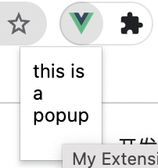
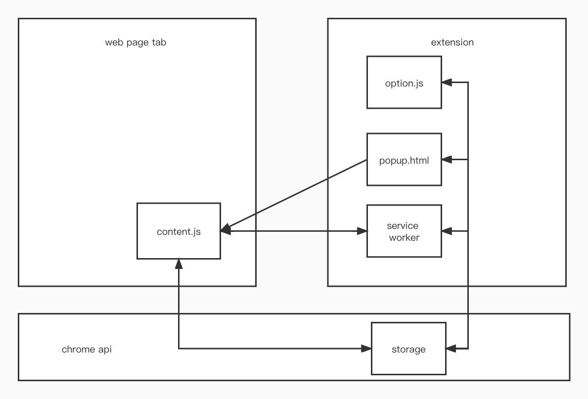

# learn-extension
## 概述
###  什么是插件
通过浏览器提供的api给用户提供一些额外的服务和功能
### 插件的组成部分
> * popup:工具栏弹窗
> * option page:选项页(单独页面或者嵌入式弹窗)
> * service worker: 插件的事件处理器，拥有chrome api所有的使用权限
> * content script/inject script: 负责获取浏览器内容(dom)并进行一些修改

### 插件的主要行为模式
> * BA (Browser Action):任何网页都生效
> * PA (Page Action):只有指定页面生效
> * neither BA nor PA:通过其他情况判断
### 主要交互手段
> * Action(popup): 工具栏弹窗
> * context menu:邮件弹窗
> * Commands:快捷键
> * Override Pages:覆盖浏览器原有页面，如查看历史
### 主要参考
[插件开发总览](https://developer.chrome.com/docs/extensions/mv3/devguide/):v3插件开发大部分的场景，了解一些基本概念后可以根据需求阅读
## 详细介绍
### manifest
manifest.json文件是基础配置，它声明了插件中用到的各个模块、权限
[官方提供的manifest参考文件](https://developer.chrome.com/docs/extensions/mv3/manifest/)
```
{
  // 必要字段
  "manifest_version": 3,
  "name": "My Extension",
  "version": "versionString",

  // 弹窗相关
  "action": {
    "default_popup":"popup.html"
  },
  "default_locale": "en",
  "description": "A plain text description",
  "icons": {...},

  // Optional
  "author": ...,
  "automation": ...,

  //后台程序
  "background": {
    // Required
    "service_worker": "background.js",
    // 脚本类型，例如module支持使用es module
    "type": module
  },

  //覆盖chrome官方页面，newtab,history,bookmarks
  "chrome_url_overrides": {...},

  //快捷键
  "commands": {...},

  //静态注入脚本
  "content_scripts": [{...}],

  //开发工具对应页面
  "devtools_page": "devtools.html",
  
  //拦截请求，触发事件的规则
  "event_rules": [{...}],
  //插件的主页
  "homepage_url": "https://path/to/homepage",
  //host权限
  "host_permissions": [...],
  
  //用户可选权限
  "optional_host_permissions": ["..."],
  "optional_permissions": ["tabs"],
  //用户选择页面
  "options_page": "options.html",
  //嵌入式弹窗用户选项页面
  "options_ui": {
    "page": "options.html"
  },
  //权限
  "permissions": ["tabs"],
}
```


### 主要交互页面
#### popup
```
{
  "manifest_version":3,
  "version":"1.0",
  "name":"test popup",

  action:{
    "default_popup":"popup.html"
  }
}
```
在浏览器右上部的插件菜单添加一个工具图标，并为其添加弹窗
[demo](./1-add-toolbar/)


#### options page
```
{
  "manifest_version":3,
  "version":"1.0",
  "name":"test popup",

  "options_page":"options.html"
}
```
### Service Worker
插件最重要的模块，作为后台监听各个页面传来的消息
```
{
  "manifest_version":3,
  "version":"1.0",
  "name":"test popup",

  "background":{
    "service_worker":"background.js"
  }
}
```

### Content script
实现静态修改页面代码的功能
```
  "manifest_version":3,
  "version":"1.0",
  "name":"test popup",

  "content_scripts":[
    {
      "matches":["*://*/*"],
      js:["content.js"]
    }
  ]
```
```
//content.js
//在页面添加一个按钮点击打印内容
let button = document.createElement("button")
button.setAttribute("id", "content")
document.body.appendChild(button)


button.onclick=function () {
    console.log("in content script")
}

```
### Passing Message

由于content script不是在插件中执行的，因此需要为其提供一种方式来与其他页面进行通信
#### 短链接
发送消息
```

//方法一 background->content
chrome.runtime.sendMessage({greeting: "hello"}, function(response) {
  console.log(response.farewell);
});

//方法二 content->background
chrome.tabs.query({active: true, currentWindow: true}, function(tabs) {
  chrome.tabs.sendMessage(tabs[0].id, {greeting: "hello"}, function(response) {
    console.log(response.farewell);
  });
});
```

接受消息
```
chrome.runtime.onMessage.addListener(
  function(request, sender, sendResponse) {
    console.log(sender.tab ?
                "from a content script:" + sender.tab.url :
                "from the extension");
    if (request.greeting === "hello")
      sendResponse({farewell: "goodbye"});
  }
);
```

#### 长连接
```
//content.js
//发送端
//创建连接参数名固定为name
let con=chrome.runtime.connect({name:"content"})

//发送
con.PostMessage({})

//接受
con.onMessage.addListener()

//断开连接
con.disconnect()

//接收端

chrome.runtime.onConnect.addListener(function(port) {})
```
[demo](./5-vue-extension),实现content script与popup/background通过消息进行通信
## 使用vue搭建插件项目
```
//全局安装vue脚手架
npm install -g @vue/cli@4 (版本过高在后续的搭建过程可能会报错)

vue create project—name
vue add browser-extension
```
项目搭建完成
该项目是通过webpack分块打包技术实现的，最后，插件会把打包的js压缩到一个压缩文件中

vue.config.js,vue打包的配置文件，基本配置参数与webpack一致
```
module.exports = {
  pages: {
    popup: {
      template: 'public/browser-extension.html',
      entry: './src/popup/main.js',
      title: 'Popup'
    },
    options: {
      template: 'public/browser-extension.html',
      entry: './src/options/main.js',
      title: 'Options'
    }
  },
  //拆插件开发项目的配置
  pluginOptions: {
    browserExtension: {
      componentOptions: {
        background: {
          entry: 'src/background.js'
        },
        contentScripts: {
          entries: {
            'content-script': [
              'src/content-scripts/content-script.js'
            ]
          }
        }
      },
      extensionReloaderOptions: {
        // 关闭自动更新页面，这会导致 WhatsApp 网页刷新后跳转到扫码登陆页面
        reloadPage: false,
      },
      //由于扩展的版本是插件v2,会在manifest中添加content_security_policy导致报错。如果不用该字段，在这里删除即可
      manifestTransformer: (manifest) => {
        delete manifest.content_security_policy
        return manifest
      },
    }
  }
}

```