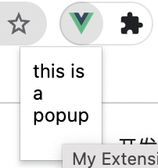

# learn-extension
## 概述
###  什么是插件
### 插件的组成部分
## 详细介绍

一个组件可以包含以下5个主要组成部分

> * toolbar icon: 显示在插件的工具栏中可以添加弹窗
> * service worker: 插件的事件处理器，拥有chrome api所有的使用权限
> * content script: 负责获取浏览器内容(dom)并进行一些修改
> * ui elements

> * option page

而这些内容的配置信息全部都给放在manifest.json文件中
基础配置

```
{
    //插件名称
  "name": "My Extension",
  //描述
  "description": "A nice little demo extension.",
  //插件业务版本好
  "version": "2.1",
  //使用的谷歌插件版本2,3
  "manifest_version": 3,


  "icons": {
    "16": "icon_16.png",
    "48": "icon_48.png",
    "128": "icon_128.png"
  },
  "background": {
    "service_worker": "background.js"
  },
  "permissions": ["storage"],
  "host_permissions": ["*://*.example.com/*"],
  "action": {
    "default_icon": "icon_16.png",
    "default_popup": "popup.html"
  }
}
```
### Toolbar Icon

在浏览器右上部的插件菜单添加一个工具图标，并为其添加弹窗
[demo](./add-toolbar/)

### Service Worker

### UI elements
### Content script
### Option Page